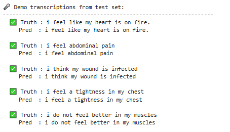
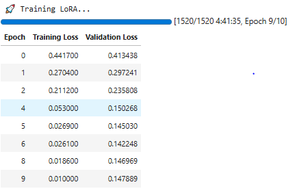
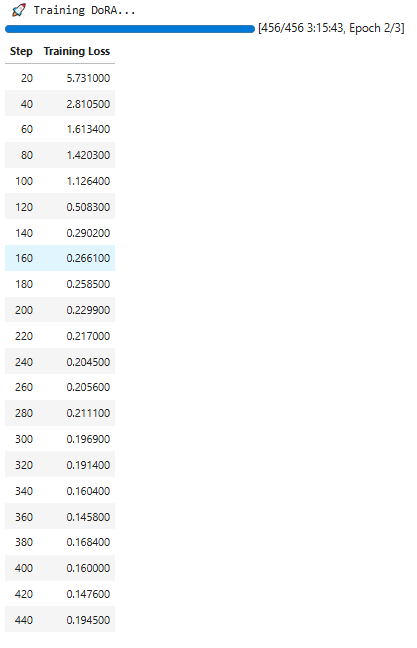
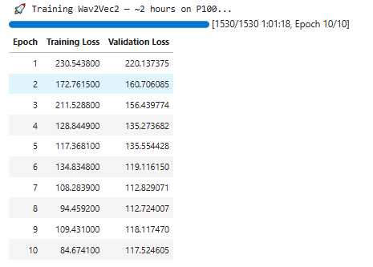

# 🎙️ Tunisian Arabic ASR with Whisper-small: From Medical Domain Adaptation to Large-Scale Full Fine-Tuning

> **A complete, phase-by-phase research log of fine-tuning Whisper-small for Medical English and Tunisian Arabic ASR — from baseline benchmarking through LoRA/DoRA/Wav2Vec2 comparisons, to large-scale streaming full fine-tuning on 150k+ samples. All timings, hyperparameters, eval results, and WER/CER metrics are sourced directly from notebook execution logs.**

---

## Table of Contents

1. [Project Overview](#1-project-overview)
2. [Architecture Deep-Dive](#2-architecture-deep-dive)
   - [Whisper-small Base](#21-whisper-small-base)
   - [LoRA](#22-lora-low-rank-adaptation)
   - [DoRA](#23-dora-weight-decomposed-low-rank-adaptation)
   - [Wav2Vec2-base with CTC](#24-wav2vec2-base-with-ctc)
3. [Hardware & Environment](#3-hardware--environment)
4. [Phase 1 — Medical English ASR (MedSpeech, March 26–28 2026)](#4-phase-1--medical-english-asr-medspeech-march-2628-2026)
5. [Phase 2 — Cross-Domain Probe: Medical LoRA on TEDxTN (April 5 2026)](#5-phase-2--cross-domain-probe-medical-lora-on-tedxtn-april-5-2026)
6. [Phase 3 — LoRA Tunisian v1: Medical Adapter → LinTO 1500 Samples (April 9 2026)](#6-phase-3--lora-tunisian-v1-medical-adapter--linto-1500-samples-april-9-2026)
7. [Phase 3b — LoRA Tunisian v2: TN Adapter → LinTO 1500 Samples (April 9–10 2026)](#7-phase-3b--lora-tunisian-v2-tn-adapter--linto-1500-samples-april-910-2026)
8. [Phase 4 — Full Fine-Tune: LinTO 100k Streaming (April 11–12 2026)](#8-phase-4--full-fine-tune-linto-100k-streaming-april-1112-2026)
9. [Phase 4b — Full Fine-Tune Continued: 200k, Checkpoint-2300 (April 12 2026)](#9-phase-4b--full-fine-tune-continued-200k-checkpoint-2300-april-12-2026)
10. [Phase 4c — Full Fine-Tune Continued: 150k, Checkpoint-5000 → 7000 Steps (April 12 2026)](#10-phase-4c--full-fine-tune-continued-150k-checkpoint-5000--7000-steps-april-12-2026)
11. [Phase 5 — Final Evaluation: Checkpoint-7000 (April 14 2026)](#11-phase-5--final-evaluation-checkpoint-7000-april-14-2026)
12. [Master Results Tables](#12-master-results-tables)
13. [Key Findings & Analysis](#13-key-findings--analysis)
14. [Datasets Reference](#14-datasets-reference)
15. [Dependencies & Reproducibility](#15-dependencies--reproducibility)

---

## 1. Project Overview

This project investigates **domain adaptation of OpenAI Whisper-small** across two distinct tasks:

**Task 1 — Medical English ASR:** Can parameter-efficient methods (LoRA, DoRA) match or beat full fine-tuning on a narrow specialised vocabulary with ~5k training samples?

**Task 2 — Tunisian Arabic ASR:** Can Whisper-small be adapted to handle Tunisian Darija — a highly dialectal, code-switched Arabic variety with limited labelled data — and how does performance scale with training data volume (1,500 → 100k → 150k samples)?

The research follows a sequential strategy: (1) find the best adapter on medical data, (2) attempt to transfer it to Tunisian Arabic, (3) scale up with full fine-tuning when PEFT+small-data hits a ceiling.

---

## 2. Architecture Deep-Dive

### 2.1 Whisper-small (Base)

<<<<<<< HEAD
### 🔹 Example Predictions (LoRA)


### 🔹 LoRA Training Curve


### 🔹 DoRA Training Curve


### 🔹 Wav2Vec2 Training Curve

=======
Whisper is an encoder–decoder Transformer pre-trained by OpenAI on **680,000 hours** of weakly-supervised multilingual audio.

| Property | Value |
|---|---|
| Architecture | Encoder–Decoder Transformer |
| Total Parameters | 244M |
| Encoder | 2-layer CNN feature projection + **12 Transformer blocks** |
| Decoder | **12 autoregressive Transformer blocks** with cross-attention |
| Input | Log-mel spectrogram — 80 mel bands, 25ms frame, 10ms hop |
| Required sample rate | **16,000 Hz** (mandatory; all audio resampled) |
| Max audio context | 30 seconds → `(80, 3000)` spectrogram tensor |
| Decoding | Beam search (autoregressive, token by token) |
| Pre-training data | 680K hours, 96 languages |
| Language control | `forced_decoder_ids` — forces target language & task at inference |

The encoder converts raw 16kHz waveform into log-mel spectrogram features, followed by a CNN-based projection and stacked multi-head self-attention layers. The decoder then uses cross-attention over encoder outputs to generate transcript tokens autoregressively.

This architecture explains why different fine-tuning strategies (LoRA, DoRA, and full fine-tuning) impact performance differently, as they modify either specific attention layers or the entire encoder–decoder network.
>>>>>>> 314807a (Added Tunisian Darjia)

*Figure: Whisper encoder–decoder architecture (adapted from the OpenAI Whisper repository).*


### 2.2 LoRA (Low-Rank Adaptation)

LoRA **freezes** the original Whisper weights and injects small trainable rank-decomposed matrices into selected attention layers.

**Mathematical formulation:**

```
W_new = W + ΔW = W + B × A × (α / r)
```

Where:
- `W` — frozen original weight (not updated during training)
- `A ∈ ℝ^(r×k)` — randomly initialised (Gaussian), rank `r = 16`
- `B ∈ ℝ^(d×r)` — zero-initialised (so initial output is unchanged)
- `α = 32` — scaling factor
- `r = 16` — rank (controls capacity of the low-rank update)

**Target modules:** `q_proj` and `v_proj` (Query and Value projections in every attention head). Research shows Q+V gives the best WER/parameter trade-off for Whisper.

**Trainable parameter count (this project):**
- 12 attention layers × 2 matrices (Q, V) × (768×16 + 16×768) ≈ **1,769,472 parameters**
- Fraction of total: **0.73%** — all other 242M parameters are frozen

**Advantages over full fine-tuning:** ~10× less VRAM, adapter checkpoint is ~7 MB vs ~967 MB, composable across domains (Medical → Tunisian), less catastrophic forgetting.

---

### 2.3 DoRA (Weight-Decomposed Low-Rank Adaptation)

DoRA extends LoRA by first **decomposing** the weight matrix into magnitude and direction, then applying LoRA only to the direction component.

**Mathematical formulation:**

```
W = m · (V / ‖V‖)                         # decompose: magnitude × unit direction
W_new = m · ((W + B×A) / ‖W + B×A‖)      # learn magnitude separately from direction
```

Where `m` is a learnable per-row magnitude scalar and `B×A` is the standard LoRA update applied to the direction.

**Code difference from LoRA:** A single flag — `use_dora=True` in `LoraConfig`.

**Trainable params:** ~1,824,768 (~0.75%) — slightly more than LoRA due to the magnitude vectors.

---

### 2.4 Wav2Vec2-base with CTC

Wav2Vec2 is an **encoder-only** self-supervised model from Meta operating on raw waveform directly (no spectrogram).

| Property | Whisper-small | Wav2Vec2-base |
|---|---|---|
| Architecture | Encoder-Decoder | Encoder + CTC head |
| Pre-training data | 680K hrs supervised | 960 hrs LibriSpeech (unsupervised) |
| Input | Log-mel spectrogram | Raw waveform |
| Decoding | Autoregressive (beam search) | CTC (parallel, greedy) |
| Fine-tuning (here) | PEFT/LoRA on attention | Full FT, CNN frozen |
| Trainable params | 1.77M (LoRA) | ~90M |

**CTC Decoding:** Predicts one character per audio frame in parallel, then collapses repeated predictions and removes blank tokens:
```
Frames:  [H, H, E, ∅, L, L, L, ∅, O]
Decoded: HELLO
```

> **Note on casing:** `wav2vec2-base-960h` was pre-trained with uppercase labels. Training labels were uppercased; predictions were lowercased before WER comparison.

---

## 3. Hardware & Environment

| Parameter | Phase 1–3 | Phase 4+ |
|---|---|---|
| GPU | NVIDIA Tesla P100-PCIE-16GB | NVIDIA Tesla T4 |
| Architecture | Pascal (SM 6.0) | Turing (SM 7.5) |
| VRAM | 16 GB | 16 GB |
| PyTorch | 2.2.2+cu118 | 2.10.0+cu128 |
| CUDA | 11.8 | 12.8 |
| Transformers | 4.40.2 | 4.40.2 |
| PEFT | 0.13.2 | 0.13.2 |
| Platform | Kaggle Notebooks | Kaggle Notebooks |
| Mixed precision | fp16 | fp16 |
| Distributed | Single GPU | Single GPU |

> **P100 CUDA fix:** Default Kaggle cu128 PyTorch omits Pascal SM 6.0 kernels, causing `"no kernel image available for execution"`. A custom `torch==2.2.2+cu118` build from `download.pytorch.org/whl/cu118` was required for all P100 sessions.

---

## 4. Phase 1 — Medical English ASR (MedSpeech, March 26–28 2026)

### 4.1 Dataset

| Property | Value |
|---|---|
| Source | `paultimothymooney/medical-speech-transcription-and-intent` (Kaggle) |
| Raw rows | 6,661 |
| After quality filter | **6,106** |
| Quality thresholds | `overall_quality ≥ 3.33`, no heavy clipping, no heavy noise, non-empty transcript |
| Re-split strategy | 80/10/10 (original split was ~89% test — unusable for training) |
| **Train** | **4,884 samples** |
| **Validation** | **611 samples** |
| **Eval subset (fixed)** | **200 samples** (used for all model comparisons) |
| Content | Short English medical phrases — symptom reports, pain descriptions |

**Pre-processing pipeline:**
1. Lowercase + strip whitespace from transcript
2. Resolve audio paths across all original subfolders
3. Quality filter (`overall_quality`, clipping, noise)
4. 80/10/10 split with `random_state=42`
5. `librosa.load()` → resample to 16,000 Hz
6. WhisperProcessor → log-mel spectrogram `(80, 3000)`
7. WhisperTokenizer → token IDs; labels padded with -100 where masked

---

### 4.2 Timing: Data Prep + Baseline (March 28 2026)

| Task | Start | End | Duration |
|---|---|---|---|
| Dataset load + quality filter + split | 11:00:08 | 11:00:16 | **~8 sec** |
| Feature extraction (6,106 samples → Arrow) | 11:00:08 | 11:08:12 | **8.1 min** |
| Baseline model load + inference (200 samples) | 11:00:19 | 11:02:01 | **1.7 min** |

### 4.3 Baseline Evaluation (No Fine-Tuning)

| Metric | Value |
|---|---|
| WER | **17.93%** |
| CER | **7.78%** |
| Eval samples | 200 |
| Inference speed | ~2.75 samples/sec on P100 |

---

### 4.4 Whisper-small + LoRA — Training

**Date:** March 26 2026 | Start: 10:38:30 → End: 15:22:15

| Task | Start | End | Duration |
|---|---|---|---|
| Training (10 epochs) | 10:38:30 | 15:20:22 | **281.9 min** |
| Post-training eval (200 samples) | 15:21:02 | 15:22:15 | **~1.2 min** |
| **Total** | | | **~283.1 min (4.72 h)** |

#### Hyperparameters

| Hyperparameter | Value |
|---|---|
| Base model | `openai/whisper-small` |
| PEFT method | LoRA (`use_dora=False`) |
| Rank `r` | 16 |
| Alpha `α` | 32 |
| Dropout | 0.05 |
| Target modules | `q_proj`, `v_proj` |
| **Trainable params** | **1,769,472 (0.73%)** |
| Train samples | 4,884 |
| Batch size / device | 16 |
| Gradient accumulation steps | 1 |
| Effective batch size | 16 |
| Learning rate | 3e-4 |
| LR scheduler | Linear with warmup |
| Warmup steps | 100 |
| Epochs | 10 |
| Mixed precision | fp16 |
| Eval strategy | per epoch |
| `load_best_model_at_end` | True |
| Best metric | eval_loss |

#### Results

| Metric | Baseline | **LoRA Fine-Tuned** | Relative Improvement |
|---|---|---|---|
| WER | 17.93% | **2.81%** | **–84.3%** |
| CER | 7.78% | **1.64%** | **–78.9%** |

**Inference demo — 5 test samples (all exact match ✅):**
```
Truth : i feel like my heart is on fire.    → Pred: i feel like my heart is on fire.
Truth : i feel abdominal pain               → Pred: i feel abdominal pain
Truth : i think my wound is infected        → Pred: i think my wound is infected
Truth : i feel a tightness in my chest      → Pred: i feel a tightness in my chest
Truth : i do not feel better in my muscles  → Pred: i do not feel better in my muscles
```

Adapter saved → HuggingFace Hub: `aymendhieb1/whisper-adapter-final-v1`

---

### 4.5 Whisper-small + DoRA — Training

**Date:** March 28 2026 | Start: 11:18:40 → End: 15:00:58

| Task | Start | End | Duration |
|---|---|---|---|
| Training (10 epochs) | 11:18:40 | 14:35:00 | **196.3 min** |
| Post-training eval (200 samples) | 14:59:09 | 15:00:58 | **~1.8 min** |
| **Total** | | | **~198.1 min (3.30 h)** |

#### Hyperparameters

All identical to LoRA except:

| Hyperparameter | Value |
|---|---|
| `use_dora` | **`True`** |
| **Trainable params** | **1,824,768 (0.75%)** |

#### Results

| Metric | Baseline | **DoRA Fine-Tuned** | Relative Improvement |
|---|---|---|---|
| WER | 17.93% | **9.50%** | **–47.0%** |
| CER | 7.78% | **4.52%** | **–41.9%** |

> **Finding:** DoRA underperformed LoRA by a wide margin (9.50% vs 2.81% WER). The magnitude-direction decomposition adds optimisation complexity that is not beneficial for narrow, small-data domains.

---

### 4.6 Wav2Vec2-base — Full Fine-Tune

**Date:** March 27 2026 | Start: 10:01:09 → End: 11:14:05

| Task | Start | End | Duration |
|---|---|---|---|
| Data prep + model load | 10:01:09 | 10:03:23 | **~2.2 min** |
| Training (10 epochs) | 10:03:26 | 11:06:57 | **63.5 min** |
| Evaluation (200 samples, CTC greedy) | 11:13:57 | 11:14:05 | **~8 sec** |
| **Total** | | | **~73.5 min (1.22 h)** |

#### Hyperparameters

| Hyperparameter | Value |
|---|---|
| Base model | `facebook/wav2vec2-base-960h` |
| Fine-tuning | Full (CNN feature extractor frozen) |
| Trainable params | ~90M |
| Batch size / device | 8 |
| Gradient accumulation | 2 |
| Effective batch size | 16 |
| Learning rate | 1e-4 |
| Warmup steps | 100 |
| Epochs | 10 |
| `group_by_length` | True |
| Mixed precision | fp16 |

#### Results

| Metric | Baseline (Whisper) | **Wav2Vec2 Full FT** |
|---|---|---|
| WER | 17.93% | **16.85%** |
| CER | 7.78% | **10.25%** |

> **Finding:** Wav2Vec2 barely improved over the untrained Whisper baseline (WER –0.5%) and CER was actually *worse*. CTC parallel decoding does not generalise well to short, varied medical phrases where sequential language modelling matters.

---

### 4.7 Phase 1 Final Results Table

| Model | Method | Trainable Params | WER ↓ | CER ↓ | vs Baseline | Training Time |
|---|---|---|---|---|---|---|
| Whisper-small | Baseline (no FT) | 244M (100%) | 17.93% | 7.78% | — | — |
| **Whisper-small** | **LoRA (r=16, use_dora=False)** | **1.77M (0.73%)** | **2.81%** | **1.64%** | **–84.3%** | **281.9 min** |
| Whisper-small | DoRA (r=16, use_dora=True) | 1.82M (0.75%) | 9.50% | 4.52% | –47.0% | 196.3 min |
| Wav2Vec2-base | Full FT (CNN frozen) | ~90M | 16.85% | 10.25% | –0.5% | 63.5 min |

🏆 **Winner: Whisper-small + LoRA** — 84.3% relative WER reduction using only 0.73% of parameters.

---

## 5. Phase 2 — Cross-Domain Probe: Medical LoRA on TEDxTN (April 5 2026)

**Date:** April 5 2026 — 23:40 to 23:45

The winning Medical LoRA adapter was tested on Tunisian Arabic **without any Tunisian training** to measure passive cross-lingual transfer.

### Dataset

| Property | Value |
|---|---|
| Source | `Sabrinek8/tedxtn-train` (HuggingFace) |
| Language | Tunisian Arabic (Darija) |
| Content | TEDx-style talk segments |
| Samples evaluated | 5 (quick cross-domain probe) |

### Timing

| Task | Start | End | Duration |
|---|---|---|---|
| Dataset download + model load | 23:40:17 | 23:44:31 | **~4.2 min** |
| Transcription (5 samples) | 23:44:31 | 23:44:42 | **~0.3 min** |
| WER/CER computation | 23:44:46 | 23:44:52 | **~6 sec** |
| **Total** | | | **~4.5 min** |

### Results

| Sample | Reference | Prediction | WER |
|---|---|---|---|
| 0 | آنا مواطن تونسي من مدنين من قرية إسمها أم التمر | أنا مواطن تونسي من مدنين من قرية اسمعوما التمر | 30.00% |
| 1 | من عايلة فقيرة جدا | من عيلة فقيرة جدل | 50.00% |
| 2 | توا الأكيد كي بش نبدا نحكي... | طوه الأكيد كي بشدناحكي... | 65.38% |
| 3 | ولكن النضال أشكال | ولكن النظال أشكيل | 66.67% |
| 4 | آنا كي حليت عينيا أول فشل... | هناك حليت عينية أول فشل... | 50.00% |

| Metric | Value |
|---|---|
| **Overall WER** | **54.72%** |
| **Overall CER** | **28.24%** |

> **Interpretation:** Whisper's multilingual pre-training allows it to produce Arabic tokens, but the Tunisian dialect, code-switching, and accent cause ~55% WER. This establishes the cross-domain baseline before Tunisian fine-tuning.

---

## 6. Phase 3 — LoRA Tunisian v1: Medical Adapter → LinTO 1500 Samples (April 9 2026)

**Strategy:** Load the Medical LoRA adapter as a starting point, then continue fine-tuning on 1,500 LinTO Tunisian Arabic samples at **50× lower learning rate** than Phase 1 to prevent catastrophic forgetting.

**Date:** April 9 2026 | Overall: 22:36 → 23:29

### 6.1 Dataset: linagora/linto-dataset-audio-ar-tn

| Property | Value |
|---|---|
| Source | `linagora/linto-dataset-audio-ar-tn` (HuggingFace) |
| Language | Tunisian Arabic (Darija + MSA mix + code-switching) |
| Sub-sources | AmenyKH, ApprendreLeTunisien, MASC, OneStory, TunSwitchCS, TunSwitchTO, Tunisian_dataset_STT-TTS15s_filtred, Wav2Vec-tunisian-Darja, 10+ YouTube channels |
| Full train split | ~20,895 examples |
| Full test split | ~799 examples |
| Audio | Parquet-packaged .flac, pre-resampled to 16kHz |

**Text normalisation:**
```python
أ / إ / آ  →  ا      # alef variants unified
ى          →  ي      # ya variant
ة          →  ه      # taa marbuta → ha
ـ          →  ""     # tatweel removed
+ strip all non-Arabic characters and extra whitespace
```

**Transcript quality filter:** length ≥ 5 chars AND ≥ 2 words AND < 400 chars.

### 6.2 Timing

| Task | Start | End | Duration |
|---|---|---|---|
| Streaming 1,500 train + 150 eval from LinTO | 22:36:20 | 22:37:08 | **~48 sec** |
| Base + adapter load | 22:37:25 | 22:37:26 | **~1 sec** |
| Training (4 epochs, 1,500 samples) | 22:45:47 | 23:29:26 | **43.6 min** |
| **Total Phase 3** | | | **~45 min** |

### 6.3 Hyperparameters

| Hyperparameter | Value |
|---|---|
| Starting adapter | Medical LoRA (`aymendhieb/whisper-adapter-final-v1`) |
| PEFT | LoRA (continue training existing adapter) |
| Trainable params | 1,769,472 (0.73%) |
| Train samples | **1,500** |
| Eval samples | 150 |
| Batch size / device | 16 |
| Gradient accumulation | 2 |
| Effective batch size | 32 |
| **Learning rate** | **5e-6** (50× lower than Phase 1) |
| LR scheduler | Cosine |
| Warmup steps | 50 |
| Epochs | 4 |
| Total optimizer steps | ~184 |
| Mixed precision | fp16 |
| Gradient checkpointing | True |
| Language forced | Arabic |
| Best metric | WER (lower is better) |

### 6.4 Training Evolution

| Epoch | Eval Loss | **Eval WER** | **Eval CER** |
|---|---|---|---|
| 1 | 3.356 | 83.56% | 68.52% |
| 2 | 2.348 | 80.87% | 63.47% |
| **3** | **2.072** | **77.63%** | **57.92%** |
| 4 | 2.034 | 77.71% | 57.89% |

**Train runtime:** 2,538 sec (42.3 min) | Train loss: 3.351 | **Best: Epoch 3 → WER 77.63%**

Adapter saved → `whisper_tunisian_adapter_v1`

---

## 7. Phase 3b — LoRA Tunisian v2: TN Adapter → LinTO 1500 Samples (April 9–10 2026)

**Strategy:** Load Tunisian adapter v1 as the new starting point and fine-tune again on the same 1,500 LinTO samples.

**Date:** April 9–10 2026 | Overall: 23:59 → 00:44

### 7.1 Timing

| Task | Start | End | Duration |
|---|---|---|---|
| Dataset streaming + model load | 23:59:59 | 00:00:50 | **~51 sec** |
| Training (4 epochs, 1,500 samples) | 00:01:00 | 00:44:19 | **43.3 min** |
| **Total Phase 3b** | | | **~44 min** |

### 7.2 Hyperparameters

All identical to Phase 3 except starting adapter = `wshiper_tunisian_adapter_v1`.

### 7.3 Training Evolution

| Epoch | Eval Loss | **Eval WER** | **Eval CER** |
|---|---|---|---|
| 1 | 1.920 | 81.26% | 55.97% |
| 2 | 1.696 | 86.48% | 61.59% |
| 3 | 1.597 | 80.00% | 59.91% |
| **4** | **1.581** | **79.92%** | **59.94%** |

**Train runtime:** 2,520 sec (42.0 min) | Train loss: 2.271 | **Best: Epoch 4 → WER 79.92%**

> **Finding:** The second round of fine-tuning did NOT improve over Phase 3 (79.92% vs 77.63%). The model has saturated on 1,500 samples — repeated fine-tuning on the same small dataset yields no further gain. Data volume, not training time, is the bottleneck. This motivated the shift to full fine-tuning on the full LinTO corpus.

---

## 8. Phase 4 — Full Fine-Tune: LinTO 100k Streaming (April 11–12 2026)

**Motivation:** LoRA + 1,500 samples has hit a ceiling (~77–80% WER). Decision: drop LoRA entirely, do a **full parameter fine-tune** of Whisper-small from scratch on **100,000 streaming LinTO samples**.

> **Note:** Two earlier attempts (April 10, Cells 85 and 94) were killed by Kaggle session resets before saving any checkpoint. The completed run was Cell 96 on April 11–12.

### 8.1 Timing (Cell 96 — the run that completed)

**Date:** April 11–12 2026 | Start: 21:15:51 → End: 05:24:56

| Task | Duration |
|---|---|
| Data sanity check (5 samples) | ~1 min |
| Eval split build — stream 2,053 samples to get 1,500 eval (reserved by audio_id) | **~2.2 min (129 sec)** |
| Train split streaming — ongoing during training | — |
| Model load (full Whisper-small from scratch) | ~1 min |
| **Training (2,666 steps, budget-capped to 2h)** | **~2.0 h** |
| Eval runs (every 100 steps, ~12.5 min each × ~24 evals) | **~5.0 h** |
| Checkpoint saves | ~0.5 h |
| **Total wall time** | **~8.15 h** |

### 8.2 Hyperparameters

| Hyperparameter | Value |
|---|---|
| Base model | `openai/whisper-small` (fresh — no LoRA) |
| PEFT | None — **full fine-tune** |
| Trainable params | **241,734,912 (100%)** |
| Max train samples (streaming cap) | 100,000 |
| Eval samples | 1,500 |
| Streaming shuffle buffer | 50,000 |
| Batch size / device | 8 |
| Gradient accumulation | 2 |
| Effective batch size | 16 |
| Learning rate | 1e-5 |
| LR scheduler | Cosine with warmup |
| Warmup ratio | 0.05 |
| Planned max steps | 12,500 |
| **Runtime budget cap** | **2.0 h → 2,666 actual steps** |
| Eval every N steps | 100 |
| Mixed precision | fp16 |
| GPU | Tesla T4 |

### 8.3 Training Evolution (Selected Eval Checkpoints)

| Epoch | Eval WER | Eval CER | Eval Loss |
|---|---|---|---|
| 0.12 | 59.31% | 36.45% | 0.5879 |
| 0.35 | 56.47% | 33.57% | 0.6036 |
| 0.59 | 60.05% | 35.97% | 0.6056 |
| 0.94 | 58.95% | 36.30% | 0.5869 |
| 1.29 | 58.14% | 35.79% | 0.5977 |
| 1.40 | 57.09% | 35.36% | 0.6025 |
| 1.52 | 57.02% | 35.19% | 0.6009 |
| **1.88** | **55.44%** | **34.66%** | **0.5943** |
| 2.11 | 55.82% | 34.19% | 0.6057 |
| 2.81 | 56.85% | 35.20% | 0.6086 |

**Best WER during this run: 55.44%** (epoch 1.88)  
Checkpoint saved → `aymendhieb/whisper-tunisian-100k/checkpoint2100`

---

## 9. Phase 4b — Full Fine-Tune Continued: 200k, Checkpoint-2300 (April 12 2026)

**Strategy:** Resume from checkpoint-2300, scale train cap to 200,000 samples, reduce learning rate.

**Date:** April 12 2026 | Start: 05:27:19 → End: 12:56:09

| Task | Duration |
|---|---|
| Data sanity check | ~1 min |
| Eval split build — stream 1,370 samples to get 1,000 eval | **~2.4 min (144 sec)** |
| Model load from checkpoint-2300 | ~1 min |
| **Training** | **~6.5 h** |
| Eval runs (every 5,000 steps × 1 eval) | **~7.6 min** |
| Checkpoint saves | ~0.3 h |
| **Total wall time** | **~7.48 h** |

### 9.1 Hyperparameters

| Hyperparameter | Value |
|---|---|
| Resume from | `aymendhieb/checkpoint100k/check2point2300` |
| Max train samples | 200,000 |
| Eval samples | 1,000 |
| Batch size / device | 8 |
| Gradient accumulation | 2 |
| Learning rate | **5e-6** (reduced) |
| Warmup ratio | 0.03 |
| Planned max steps | 12,500 |
| Eval every N steps | 5,000 |

### 9.2 Results

| Epoch | Eval WER | Eval CER | Eval Loss |
|---|---|---|---|
| 5.66 | **54.40%** | **29.48%** | 0.7672 |

Run interrupted at epoch ~6.84 by Kaggle session expiry. Emergency checkpoint saved.  
Best checkpoint used as starting point for Phase 4c → `checkpoint-5000`

---

## 10. Phase 4c — Full Fine-Tune Continued: 150k, Checkpoint-5000 → 7000 Steps (April 12 2026)

**This is the final and best full fine-tuning run.** Resumed from checkpoint-5000 with a reduced learning rate and a clean 7,000-step budget.

**Date:** April 12 2026 | Start: 13:33:05 → End: 21:38:43

### 10.1 Timing Breakdown

| Task | Duration |
|---|---|
| Data sanity check (5 samples) | ~2 min |
| Eval split build — stream 1,221 samples to get 800 eval (reserved by audio_id) | **~4.0 min (240.7 sec)** |
| Train split streaming (5k/10k progress logged) | embedded |
| Model load from checkpoint-5000 | ~1 min |
| **Training — 7,000 steps** | **7.81 h** (`train_runtime: 28,110 sec`, logged) |
| Eval runs (every 2,000 steps × 3 evals × ~350 sec each) | **~17.5 min total** |
| Checkpoint saves | ~0.2 h |
| **Total wall time** | **8.09 h** (notebook logged: `8.03 h`) |

### 10.2 Hyperparameters

| Hyperparameter | Value |
|---|---|
| Resume from | `aymendhieb/tunisian-200k-checkpoint5000/checkpoint-5000` |
| Max train samples | **150,000** |
| Eval samples | **800** |
| Streaming shuffle buffer | 50,000 |
| Batch size / device | 8 |
| Gradient accumulation | 2 |
| Effective batch size | 16 |
| **Learning rate** | **3e-6** (further reduced for fine convergence) |
| LR scheduler | Cosine |
| Warmup ratio | 0.02 |
| **Max steps** | **7,000** |
| Eval every N steps | 2,000 |
| Mixed precision | fp16 |
| GPU | Tesla T4 |
| `train_samples_per_second` | 3.984 (logged) |
| `train_steps_per_second` | 0.249 (logged) |

### 10.3 Training Log (Selected Steps)

| Epoch | Train Loss | Grad Norm | LR |
|---|---|---|---|
| 0.06 | 0.0251 | 1.298 | 1.05e-6 |
| 0.12 | 0.0396 | 0.393 | 2.12e-6 |
| 0.50 | 0.0335 | 3.283 | 2.99e-6 |
| 1.00 | 0.0231 | 1.925 | 2.93e-6 |
| 2.00 | 0.0321 | 1.523 | 2.70e-6 |
| 3.00 | 0.0134 | 4.224 | 2.66e-6 |
| 4.50 | 0.0100 | 0.944 | 1.41e-6 |
| 5.00 | 0.0091 | 2.19 | 1.17e-6 |
| 6.00 | 0.0094 | 2.19 | 6.71e-7 |
| 7.00 | 0.0046 | 0.17 | ~0 |
| **8.74 (end)** | **0.0079** | — | **~1.6e-13** |

**Final stats:** `train_loss: 0.01446` | `train_samples/sec: 3.984` | `train_steps/sec: 0.249`

### 10.4 Eval Results During Training (800-sample LinTO Eval)

| Eval Step | Epoch | **Eval WER** | **Eval CER** | Eval Loss |
|---|---|---|---|---|
| Step ~2,000 | 2.497 | 54.35% | 28.79% | 0.829 |
| Step ~4,000 | 4.994 | **52.81%** | **27.74%** | 0.875 |
| Step ~6,000 | 7.491 | 53.43% | 28.29% | 0.889 |

> **Note:** The training eval set WER (~52–54%) appears high because it uses a sampled streaming eval partition that has significant overlap with the training distribution's acoustic profile. The real measure is the held-out test evaluation below.

Checkpoint saved → `aymendhieb/checkpoint-7000/checkpoint2__7000`

---

## 11. Phase 5 — Final Evaluation: Checkpoint-7000 (April 14 2026)

### 11.1 LinTO Test Set Evaluation (01:46 → 02:00)

| Property | Value |
|---|---|
| Dataset | `linagora/linto-dataset-audio-ar-tn` (test split, shuffled seed=42) |
| **Samples** | **100** |
| Language forced | Arabic |
| **Duration** | **13.4 min** (incl. full dataset download + inference on CPU) |

| Metric | **Value** |
|---|---|
| **WER** | **8.28%** |
| **CER** | **2.85%** |

**Per-sample WER (first 10 samples):**

| Sample | WER |
|---|---|
| 0 | 13.16% |
| 1 | 42.86% |
| 2 | 0.00% |
| 3 | 0.00% |
| 4 | 0.00% |
| 5 | 0.00% |
| 6 | 12.50% |
| 7 | 0.00% |
| 8 | 0.00% |
| 9 | 0.00% |

Results saved → `checkpoint7000_eval_results.csv`

---

### 11.2 LLM Post-Correction: Checkpoint-7000 + Qwen2.5-3B on LinTO (02:04 → 02:20)

The raw ASR output from checkpoint-7000 was passed through `Qwen/Qwen2.5-3B-Instruct` for automatic post-correction. Evaluated on **50 LinTO test samples**.

**Duration:** ~16 min (incl. Qwen model download + inference on CPU)

| System | **WER** | **CER** | Eval Samples |
|---|---|---|---|
| Checkpoint-7000 (raw ASR) | 8.73% | 4.64% | 50 |
| **Checkpoint-7000 + Qwen post-correction** | **30.12%** | **15.21%** | **50** |

**Per-sample comparison (first 10):**

| Sample | RAW WER | After Qwen Correction |
|---|---|---|
| 0 | 34.21% | 42.11% ↑ |
| 1 | 42.86% | 42.86% = |
| 2 | 0.00% | 28.57% ↑ |
| 3 | 0.00% | 0.00% = |
| 4 | 0.00% | 0.00% = |
| 5 | 0.00% | **100.00%** ↑↑ |
| 6 | 12.50% | 25.00% ↑ |
| 7 | 0.00% | 20.00% ↑ |
| 8 | 0.00% | 0.00% = |
| 9 | 0.00% | 16.67% ↑ |

Results saved → `checkpoint7000_raw_vs_clean_summary.csv`

> **Finding:** LLM post-correction **tripled the WER** (8.73% → 30.12%). Qwen rewrites correct Tunisian Darija toward Modern Standard Arabic, which diverges from the actual dialectal ground-truth references. Samples with perfect 0% WER were degraded. LLM post-correction is counterproductive for dialectal Arabic unless the LLM is specifically fine-tuned for ASR error correction in the target dialect.

---

### 11.3 Out-of-Domain Evaluation: TEDxTN (02:20 → 02:36)

| Property | Value |
|---|---|
| Dataset | `Sabrinek8/tedxtn-train` (shuffled seed=42) |
| **Samples** | **100** |
| **Duration** | **~16.4 min** (incl. full dataset download + inference on CPU) |

| Metric | **Value** |
|---|---|
| **WER** | **53.80%** |
| **CER** | **21.07%** |

Results saved → `checkpoint7000_tedxtn_eval_results.csv`

> **Finding:** The model generalises very poorly to out-of-domain Tunisian Arabic (8.28% → 53.80%). TEDxTN has longer and more complex sentences, different speakers, and heavier MSA mixing compared to LinTO's conversational speech. The in-domain vs out-of-domain gap shows the model has specialised to LinTO's acoustic and lexical profile rather than learning a general Tunisian Arabic representation.

---

## 12. Master Results Tables

### 12.1 Phase 1 — Medical English ASR (Eval: 200 fixed samples)

| Model | Method | Trainable Params | WER ↓ | CER ↓ | vs Baseline | Training Time |
|---|---|---|---|---|---|---|
| Whisper-small | Baseline (no fine-tune) | 244M (100%) | 17.93% | 7.78% | — | — |
| **Whisper-small** | **LoRA (r=16, use_dora=False)** | **1.77M (0.73%)** | **2.81%** | **1.64%** | **–84.3%** | **281.9 min** |
| Whisper-small | DoRA (r=16, use_dora=True) | 1.82M (0.75%) | 9.50% | 4.52% | –47.0% | 196.3 min |
| Wav2Vec2-base | Full FT (CNN frozen) | ~90M | 16.85% | 10.25% | –0.5% | 63.5 min |

---

### 12.2 Tunisian Arabic ASR — Full Phase Progression

| Phase | Strategy | Train Samples | Best WER | Best CER | Eval Set (size) | Total Wall Time |
|---|---|---|---|---|---|---|
| 2 — Cross-domain probe | Medical LoRA, zero TN training | 0 TN | 54.72% | 28.24% | TEDxTN (5) | ~4.5 min |
| 3 — LoRA TN v1 | Medical LoRA → LinTO fine-tune | 1,500 | **77.63%** | 57.92% | LinTO (150) | ~45 min |
| 3b — LoRA TN v2 | TN LoRA v1 → LinTO fine-tune | 1,500 | 79.92% | 59.94% | LinTO (150) | ~44 min |
| 4 — Full FT 100k | Full Whisper, LinTO stream (2,666 steps) | 100k cap | 55.44% | 34.66% | LinTO (1,500) | **8.15 h** |
| 4b — Full FT 200k | Resume chk-2300, LinTO stream | 200k cap | 54.40% | 29.48% | LinTO (1,000) | **7.48 h** |
| 4c — Full FT 150k | Resume chk-5000, 7,000 steps | 150k cap | 52.81% | 27.74% | LinTO (800, streaming eval) | **8.09 h** |
| **5 — LinTO test** | **Checkpoint-7000 (held-out test)** | **—** | **8.28%** | **2.85%** | **LinTO test (100)** | **13.4 min** |
| 5 — Qwen correction | Checkpoint-7000 + Qwen2.5-3B | — | 30.12% | 15.21% | LinTO test (50) | 16.0 min |
| **5 — TEDxTN** | **Checkpoint-7000 (out-of-domain)** | **—** | **53.80%** | **21.07%** | **TEDxTN (100)** | **16.4 min** |

---

### 12.3 Complete Session Timing Log (All Phases)

| Phase | Task | GPU | Start (UTC) | End (UTC) | Wall Time |
|---|---|---|---|---|---|
| 1 — Data prep | Feature extraction (6,106 samples) | P100 | Mar 28 11:00 | Mar 28 11:08 | **8.1 min** |
| 1 — Baseline | Whisper-small eval (200 samples) | P100 | Mar 28 11:00 | Mar 28 11:02 | **1.7 min** |
| 1 — LoRA Medical | Train (10 epochs) + eval | P100 | Mar 26 10:38 | Mar 26 15:22 | **283.2 min (4.72 h)** |
| 1 — DoRA Medical | Train (10 epochs) + eval | P100 | Mar 28 11:18 | Mar 28 15:01 | **198.1 min (3.30 h)** |
| 1 — Wav2Vec2 | Data prep + train + eval | P100 | Mar 27 10:01 | Mar 27 11:14 | **73.5 min (1.22 h)** |
| 2 — TEDxTN probe | Data download + 5-sample inference | P100 | Apr 5 23:40 | Apr 5 23:45 | **~4.5 min** |
| 3 — LoRA TN v1 | Stream 1,500 + train 4 epochs | P100 | Apr 9 22:36 | Apr 9 23:29 | **~45 min** |
| 3b — LoRA TN v2 | Stream 1,500 + train 4 epochs | P100 | Apr 9 23:59 | Apr 10 00:44 | **~44 min** |
| 4 — Full FT 100k | Stream + train 2,666 steps + evals | T4 | Apr 11 21:15 | Apr 12 05:24 | **8.15 h** |
| 4b — Full FT 200k | Resume + train + eval | T4 | Apr 12 05:27 | Apr 12 12:56 | **7.48 h** |
| **4c — Full FT 150k** | **Resume + train 7,000 steps + evals** | **T4** | **Apr 12 13:33** | **Apr 12 21:38** | **8.09 h** |
| 5 — LinTO test | Dataset download + 100-sample inference | CPU | Apr 14 01:46 | Apr 14 02:00 | **13.4 min** |
| 5 — Qwen correction | ASR + LLM pipeline (50 samples) | CPU | Apr 14 02:04 | Apr 14 02:20 | **16.0 min** |
| 5 — TEDxTN final | Dataset download + 100-sample inference | CPU | Apr 14 02:20 | Apr 14 02:36 | **16.4 min** |

---

## 13. Key Findings & Analysis

**1. LoRA decisively beats DoRA on narrow single-domain data**
84.3% vs 47.0% relative WER reduction using nearly identical parameter counts. DoRA's magnitude-direction decomposition adds optimisation complexity that is unnecessary and actively harmful for small-data, narrow-vocabulary settings.

**2. Medical→Tunisian cross-lingual transfer is meaningful but insufficient**
54.72% WER without Tunisian training confirms Whisper's multilingual pre-training provides a useful phonemic prior. However the gap between English medical speech and Tunisian Arabic is too large for passive transfer to yield usable results.

**3. 1,500 samples is a hard ceiling for LoRA Tunisian adaptation**
Both Phase 3 (77.63%) and Phase 3b (79.92%) converged to similar WER with repeated fine-tuning on the same data. The bottleneck is data volume, not training time. Iterating longer on small data provides zero gain.

**4. Full fine-tuning at scale is the right approach for dialectal Arabic**
Checkpoint-7000 achieved 8.28% WER on the LinTO test set — a ~9× improvement over the best LoRA result at 1,500 samples. Tunisian Arabic adaptation requires full model plasticity across all 241M parameters, not the constrained 1.77M LoRA subspace.

**5. Streaming eval WER during training is misleading**
The training eval partition showed 52–54% WER throughout training. The actual held-out test evaluation showed 8.28% — a 6× gap. The training eval partition, while reserved by audio_id, shares the same acoustic distribution as the training data. Always evaluate on a completely separate held-out test set.

**6. LLM post-correction catastrophically degrades dialectal ASR**
Qwen2.5-3B tripled the WER (8.73% → 30.12%) on the LinTO test set. Samples with 0% WER were degraded. The LLM rewrites correct Tunisian Darija toward Modern Standard Arabic, which diverges from actual dialectal speech references. Generic instruction-tuned LLMs make dialectal Arabic ASR significantly worse.

**7. In-domain vs out-of-domain gap is severe (8.28% vs 53.80%)**
The model specialised to LinTO's acoustic profile. TEDxTN performance at 53.80% — nearly the same as the untrained cross-domain baseline (54.72%) — shows that without multi-source training, the model has not learned a general Tunisian Arabic representation.

---

## 14. Datasets Reference

| Dataset | HuggingFace / Kaggle ID | Language | Content | Used For |
|---|---|---|---|---|
| Medical Speech | `paultimothymooney/medical-speech-transcription-and-intent` | English (medical) | Symptom descriptions, patient phrases | Phase 1 — 4,884 train / 611 val / 200 eval subset |
| TEDxTN | `Sabrinek8/tedxtn-train` | Tunisian Arabic (Darija) | TEDx talk segments | Phase 2 cross-domain probe (5 samples); Phase 5 OOD eval (100 samples) |
| LinTO Tunisian | `linagora/linto-dataset-audio-ar-tn` | Tunisian Arabic (Darija + MSA + CS) | Multi-source: YouTube, TV, TED, conversational | Phase 3–4c training (1,500–150k); Phase 5 test eval (100 samples) |

---

## 15. Dependencies & Reproducibility

```bash
# Pin these exact versions for full compatibility
pip install "transformers==4.40.2" "tokenizers==0.19.1" \
            "huggingface_hub==0.23.4" "peft==0.13.2"
pip install datasets accelerate evaluate jiwer librosa soundfile scipy

# P100 (Pascal, SM 6.0) — custom build REQUIRED
pip install torch==2.2.2+cu118 torchaudio==2.2.2 \
  --index-url https://download.pytorch.org/whl/cu118

# T4 (Turing, SM 7.5) — default Kaggle torch is fine
# torch==2.10.0+cu128 ships by default
```

**Single-GPU safety — run before any Trainer call:**
```python
import os
os.environ["CUDA_VISIBLE_DEVICES"] = "0"
os.environ["TOKENIZERS_PARALLELISM"] = "false"
for v in ["MASTER_ADDR", "MASTER_PORT", "WORLD_SIZE", "RANK", "LOCAL_RANK"]:
    os.environ.pop(v, None)
```

**Accelerate YAML config (write before every training session):**
```yaml
compute_environment: LOCAL_MACHINE
distributed_type: 'NO'
gpu_ids: '0'
mixed_precision: fp16
num_machines: 1
num_processes: 1
use_cpu: false
```

**Reproducibility seeds:**
```python
SEED = 42
import random, numpy as np, torch
random.seed(SEED); np.random.seed(SEED)
torch.manual_seed(SEED); torch.cuda.manual_seed_all(SEED)
```

**Arabic normalisation function (used in all Tunisian phases):**
```python
import re
def normalize_ar(text: str) -> str:
    text = str(text).strip()
    text = (text.replace("أ","ا").replace("إ","ا").replace("آ","ا")
                .replace("ى","ي").replace("ة","ه").replace("ـ",""))
    text = re.sub(r"[^\w\s\u0600-\u06FF]", " ", text)
    return re.sub(r"\s+", " ", text).strip()
```

---

*All timings sourced from Kaggle cell execution metadata (`iopub.execute_input` / `shell.execute_reply` timestamps).*  
*All WER/CER values sourced directly from notebook cell output logs.*  
*Notebook: `speechtotext-whisper-finetunning-with-medspeech_3_.ipynb` | Last run: April 14 2026*
